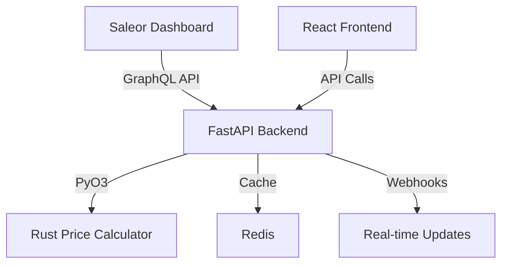

# Saleor Price Manager

🚀 **FastAPI microservice for dynamic multi-channel pricing in Saleor eCommerce with high-performance Rust calculations**

[](https://fastapi.tiangolo.com/)
[](https://www.rust-lang.org/)
[](https://www.python.org/)
[](https://saleor.io/)

## ⚡ Quick Start

### 1️⃣ Deploy (Setup Environment)
```bash
./DEPLOY
```
This will:
- ✅ Create Python virtual environment
- ✅ Install all dependencies from requirements.txt  
- ✅ Build Rust module for high-performance calculations
- ✅ Create `.env` configuration file
- ✅ Setup frontend dependencies

### 2️⃣ Configure (Optional)
```bash
vim .env
```
Update with your Saleor Cloud credentials:
```env
# Your Saleor Cloud instance
SALEOR_API_URL=https://your-instance.eu.saleor.cloud/graphql/
SALEOR_APP_TOKEN=your_api_token_here

# Redis for caching (optional)
REDIS_URL=redis://localhost:6379/0
```

### 3️⃣ Start the Application
```bash
./BANG
```

**🎉 Your API is ready!** Available at:
- **📊 Swagger UI**: http://localhost:8000/docs
- **📖 ReDoc**: http://localhost:8000/redoc  
- **💚 Health Check**: http://localhost:8000/health

---

## 🏗️ Architecture

- **🔥 FastAPI** - Modern async API framework with automatic documentation
- **🦀 Rust Module** - High-performance price calculations via PyO3
- **📋 Redis** - Fast caching for markup data (optional)
- **🌐 Saleor Integration** - GraphQL API client with webhook support
- **⚙️ React Frontend** - Management interface for Saleor Dashboard



---

## 🌟 Demo Mode

**No Saleor token?** The application works perfectly in demo mode!

```bash
./BANG  # Starts with demo data automatically
```

**Demo Features:**
- ✅ 3 sample channels (Default, Moscow Store, SPb Store)
- ✅ Working price calculations with markups  
- ✅ Full API functionality
- ✅ Interactive Swagger UI

**Example API Call:**
```bash
curl -X POST http://localhost:8000/api/prices/calculate \
  -H "Content-Type: application/json" \
  -d '{
    "product_id": "UHJvZHVjdDox",
    "channel_id": "Q2hhbm5lbDoy", 
    "base_price": 100.00
  }'

# Response: $100 → $115 (15% markup for Moscow Store)
{
  "base_price": "100.0",
  "markup_percent": "15",
  "final_price": "115.00"
}
```

---

## 📡 API Endpoints

### Channels Management
- `GET /api/channels/` - List all channels with markup info
- `POST /api/channels/markup` - Set markup percentage for channel

### Price Calculations  
- `POST /api/prices/calculate` - Calculate single product price
- `POST /api/prices/batch-calculate` - Bulk price calculations

### Webhooks
- `POST /webhooks/product-updated` - Handle Saleor product updates
- `POST /webhooks/channel-created` - Handle new channel creation

### Health & Docs
- `GET /health` - Health check endpoint
- `GET /docs` - Interactive Swagger UI
- `GET /redoc` - ReDoc documentation

---

## 🔧 Development Workflow

### Building Rust Module
```bash
./BUILD  # Rebuild only the Rust price calculator
```

### Running Tests
```bash
./TEST   # Run application tests
```

### File Structure
```
saleor-price-manager/
├── app/                     # FastAPI application
│   ├── api/                 # API route handlers
│   ├── core/                # Configuration & security
│   ├── models/              # Pydantic data models
│   ├── saleor/              # Saleor API integration
│   └── services/            # Business logic services
├── rust_modules/            # High-performance Rust modules
│   └── price_calculator/    # Price calculation engine
├── frontend/                # React management interface
├── scripts/                 # Utility scripts
└── docs/                    # Documentation
```

---

## 🚀 Production Deployment

### Docker
```bash
docker-compose up --build
```

### Manual Server Setup
See [PRODUCTION.md](PRODUCTION.md) for detailed production deployment guide including:
- Ubuntu server setup
- Nginx configuration  
- SSL certificates
- Monitoring & logging

---

## 🔗 Saleor Cloud Integration

### Getting API Token
1. **Visit your Saleor Dashboard**: https://your-instance.eu.saleor.cloud/dashboard/
2. **Navigate to Apps**: Look for "Apps" → "Third party apps" → "Create app"
3. **Alternative**: Settings → Staff Members → Generate token
4. **Update .env**: Add your token to `SALEOR_APP_TOKEN`

### Required Permissions
- `MANAGE_CHANNELS` - For channel markup management
- `MANAGE_PRODUCTS` - For price calculations

---

## ⚡ Performance Features

- **🦀 Rust Calculations** - 10x faster than pure Python
- **📋 Redis Caching** - Sub-millisecond markup lookups
- **⚙️ Async Operations** - Non-blocking I/O throughout
- **📊 Batch Processing** - Handle thousands of products efficiently

---

## 🛠️ Troubleshooting

### Common Issues

**❌ "Redis not available"**
```bash
# Option 1: Install Redis
sudo apt install redis-server
sudo systemctl start redis-server

# Option 2: Use Docker
docker run -d -p 6379:6379 redis:7.0

# Option 3: Continue without Redis (uses in-memory cache)
# Application works fine without Redis!
```

**❌ "Rust module not found"**
```bash
./BUILD  # Rebuild the Rust module
```

**❌ "Permission denied"**
```bash
chmod +x ./DEPLOY ./BANG ./BUILD
```

**❌ "Port 8000 already in use"**
```bash
# Find and kill process using port 8000
lsof -ti:8000 | xargs kill -9

# Or change port in .env
echo "APPLICATION_PORT=8001" >> .env
```

### Getting Help
- 📚 **Full Documentation**: See [docs/api/README.md](docs/api/README.md)
- 🐛 **Issues**: Create GitHub issue with logs from `./BANG`
- 💬 **Questions**: Include your `.env` (without tokens) and error messages

---

## 🤝 Contributing

1. Fork the repository
2. Create feature branch: `git checkout -b feature/my-feature`
3. Make changes and test: `./TEST`
4. Commit changes: `git commit -m "add my feature"`
5. Push and create pull request

---

## 📄 License

MIT License - see [LICENSE](LICENSE) file for details.

---

**Made with ❤️ for the Saleor ecosystem**